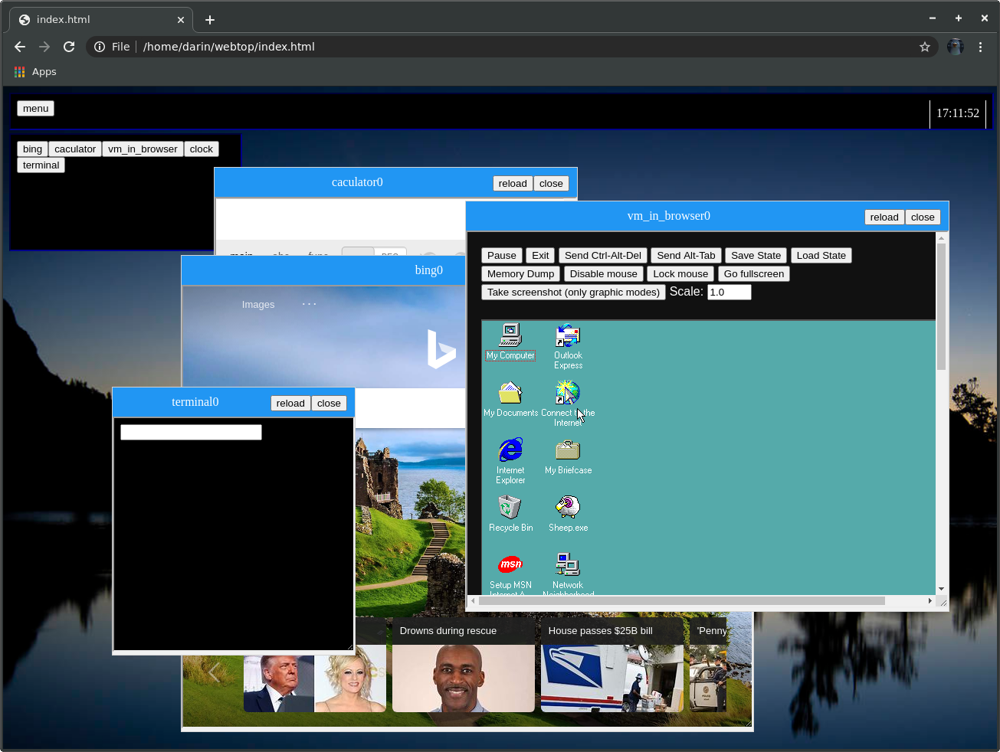

# Webtop- The web desktop

## [live demo](https://darin755.github.io/webtop/)

## What is Webtop?
 - Webtop is a web desktop enviroment written in HTML, CSS and Javascript. 
 - It is based on iframes that load pages that can comunicate with postMessage. 
 - This version is currently just a proof of concept.
 ## How is it designed
 - Webtop consists of to sections, Apps and System. The apps are not required and some rely on system. The system is interconected and is the base of which webtop is build on. System is broken down into smaller parts. 
 ### The System
 - Config stores configration scripts that set variables in the system. 
 - Core is the core of webtop and has core.js which haddles most non-gui functions and wm_core.js which is the wm. 
 - Define has define.js which defines system functions. There is currently only one function stored there. 
 - Menu stores the webpage that is deplayed in the menu. Taskbar is the webpage and the scripts for the taskbar which is currently required for the wm to function correctly.

## This is a project I did a few years back
## I sometimes will work on it but it is mostly dormant 

